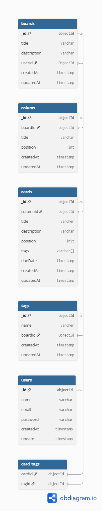

## Database Schema


## Architecture and folder reasoning
```text
doc/
src/
│
├─ config/          # Database and environment configuration
├─ middleware/      # Custom middleware (error handling, auth)
├─ modules/         # Feature-based modules
│   ├─ board/
│   │   ├─ boardController.js
│   │   ├─ boardModel.js
│   │   ├─ boardRepository.js
│   │   ├─ boardRoutes.js
│   │   └─ boardService.js
│   ├─ column/
│   ├─ card/
│   ├─ comment/
│   └─ user/
├─ realtime/        # Socket.IO real-time events and emitters
├─ test/            # Unit & integration tests
├─ server.js        # Entry point
└─ swagger.yaml     # API documentation

 ## REQUSET FLOW
Client Request → Route → Controller → Service → Repository → Response

Key Points:

Modular architecture ensures clear separation of concerns

Each layer handles a single responsibility, improving maintainability, testing, and scalability
    


## Key engineering decision
Authentication: JWT stored in req.user to validate requests

Authorization: Only users or members can access board resources


## Schema Relationship
User → Board : One-to-Many
Board → Column : One-to-Many
Column → Card : One-to-Many
Card → Tag : Many-to-Many

## CARD ORDERING STRATEGY
CEach card has a numeric position field

Move operation:

Source column: Decrement positions greater than removed card

Destination column: Increment positions greater than or equal to new position

MongoDB transaction: Ensures atomic move to prevent data corruption

Benefits:

No duplicate positions

Consistent ordering

Safe concurrent updates

## CONFLICT STRATEGY
Optimistic concurrency control with version field per card

Flow:

Client fetches card → receives version

Client sends same version on update

Backend updates only if versions match

If mismatch → returns 409 Conflict

This prevent users from overwritting changes made by other collaborators.

## PERFORMANCE IMPROVEMENTS FOR PAGINATION FOR BOARD AND CARDS
Offset-based pagination: GET /boards?page=1&limit=10

Sorting:

Boards → createdAt

Cards → position

Optimized queries
boardModel
  .populate("members", "name email")
  .populate("ownerId", "name")
cardModel.select("title position columnId")

Benefits: Reduces query cost, memory usage, improves response time, ensures scalability

## REAL-TIME APPROACH
User need instant updates when another user creates, moves, or comments on a card.

SOCKET.IO + ROOM
Each board has a dedicated room
Client join the room upon viewing a board
Server emits event only to that room 

## LOGGING AND OBSERVABILITY
Structured logging useing LOGGER(info, warn, error)
Logs inculded context: userId, boardId, cardId
Enable debugging of:
version conflicts
Failed board access
Transaction failures

## link to deploy api
https://board-system-backend-project.onrender.com/
